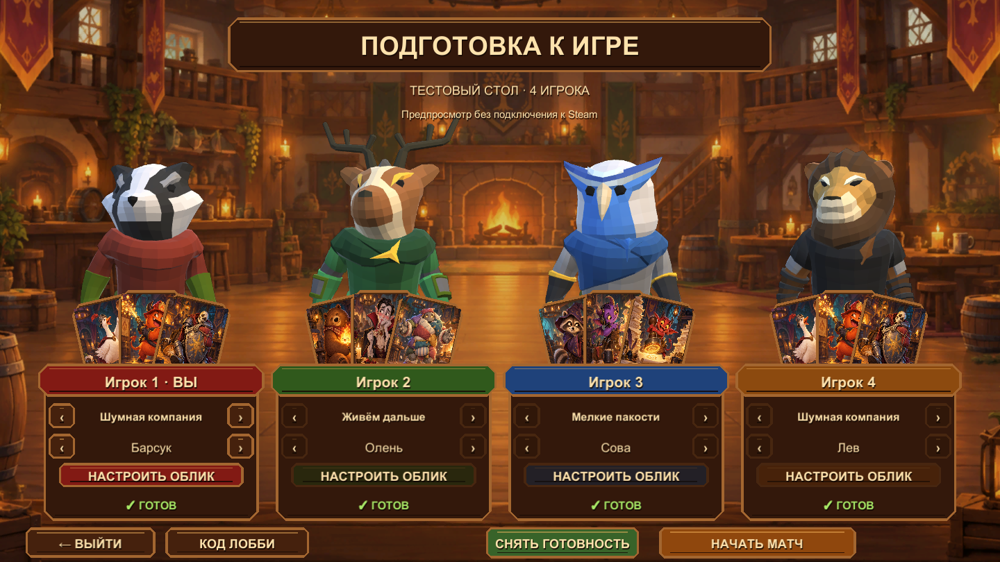

# За одним столом

Карточная потасовка для 2–4 игроков: круглый 3D-стол, ручная камера, рука в интерфейсе, QTE и реакции на розыгрыш. Три раунда FFA, три колоды по 30 карт, 30 уникальных карт. Steam-лобби и случайный соперник на тестовом App ID 480; дополнительно локальная игра с передачей управления.

## Версия 0.4.1

Реакции накладываются на разыгрываемую карту в интерфейсе с наклоном около 20°. После QTE призыва левый показ убирается у всех. У стрелки удалён VFX. Добавлены раскрываемый журнал ходов с наведением на исходные и целевые карты, подсветка всех доступных розыгрышей, рубашки по числу карт рядом с героями и информация о герое только при наведении. Баланс и PDF остаются 0.3.0.

Лобби оформлено как таверна из референса: четыре цветные панели, живые 3D-портреты, колоды и облик. Подключены восемь героев ModularAnimalKnightsPolyart, 8 доспехов и 4 палитры, мебель, анимации, VFX, Card_Game audio и Motion Titles из ветки `stuff`. Выбор героя и поворот головы передаются по сети. [Передача ассетов и соответствие message](docs/TAVERN-ASSETS.md).

Сохранены изменения 0.3.1

Исправления интерфейса: после центрального показа карта у всех переходит влево и у существа исчезает после завершения QTE. Справа — только карта под курсором, из руки, со стола или из левого слота. Новый призыв опускается на стол без автоматического выбора. Для назначения цели зажмите ЛКМ на своём существе, вытяните стрелку и отпустите над целью или центром. Звенья стрелки добавляются по мере вытягивания; сброс вне допустимой цели сохраняет прежнее назначение.

- Существо разыгрывается в явно выбранный свободный слот. После QTE выберите ему цель; все атаки происходят после «Закончить ход». Неназначенные стрелки автоматически уходят в центр, то есть на случайного вражеского героя.
- Заклинание получает цель до QTE и срабатывает сразу после успеха. Карта публично показывается 2 секунды; буквы и таймер QTE приватны, прогресс и оставшиеся попытки видны огоньками на столе.
- Реакции действуют во время чужого розыгрыша, никогда на атаку существа. R02 копирует успешный призыв в такой же свободный слот, R03 возвращает исходную карту владельцу. R01 и R04 защищают от заклинаний.
- Три ракурса переключаются колесом; зажатая ПКМ вращает взгляд. Ход не меняет ракурс. Параметры доступны в инспекторе и JSON.
- Сцены MainMenu, Lobby, Match и PresentationLab; редактируемые префабы стола, мест, слотов и Canvas. Модели, анимации и эффекты из stuff подключены. Полная 3D-комната не создавалась.
- Сетевой протокол 5, отдельный фильтр лобби 0.3.0. Всем игрокам нужен одинаковый билд.

## Запуск

Распакуйте **всю папку** из `output/ZaOdnimStolom-Windows-v0.4.1.zip`, запустите Steam, затем `ZaOdnimStolom.exe`. Для онлайна нужны разные Steam-аккаунты и ПК. Без Steam доступна игра за одним ПК. Версия баланса и PDF остаётся 0.3.0; 0.4.1 добавляет журнал в сетевое состояние и обновляет представление.

- Unity-проект: `SummonersTable`, редактор **6000.3.21f1**, Windows Build Support.
- Локальная сборка: `Builds/Windows-v0.4.1/ZaOdnimStolom.exe`.
- Правила и все карты: [PDF 0.3](output/pdf/arena-test-decks-v0.3.pdf).
- Управление и проверка с друзьями: [PLAYTEST-RU.txt](docs/PLAYTEST-RU.txt).
- Работа со сценами, JSON и будущими ассетами: [3D-HANDOFF.md](docs/3D-HANDOFF.md).
- Результаты и ограничения проверки: [QA-REPORT.md](docs/QA-REPORT.md).

Исходники, `.meta`, 33 исходные иллюстрации, новый фон лобби, ассеты stuff, каталог, PDF и отчёты включены в репозиторий. Билды, кэш Unity и локальные логи исключены из Git. Исходная 2D-версия остаётся в [релизе v0.1.0](https://github.com/ErmakRu/za-odnim-stolom/releases/tag/v0.1.0).

## Сборка и изменение баланса

Откройте `Assets/Scenes/MainMenu.unity`. Пакеты Steamworks.NET 2025.164.1 и uGUI 2.0.0 закреплены. Меню `Summoners Table > Validate rules` запускает проверки правил и презентации; `Build Windows` создаёт Windows x64 Mono Player. Команда `Create missing scenes and prefabs` создаёт отсутствующие ресурсы и сохраняет уже существующие пользовательские сцены и префабы.

Измените `tools/create_catalog.py`, затем выполните `python tools/create_catalog.py` и `python tools/build_handbook.py` (reportlab, pypdf, Pillow, Windows Arial). После сборки `python tools/package_release.py` создаёт проверенные ZIP и манифест SHA-256.

## Архитектура

`Core/GameEngine.cs` — авторитетные правила, команды, очки, QTE и пошаговое разрешение боя. `MatchState.View` скрывает чужие руки, буквы и таймер QTE. Публичные счётчики находятся в `CastState`; короткая история `CombatEvent` позволяет клиентам воспроизвести атаки даже после сетевого обновления состояния.

`Core/MatchHistory.cs` — публичные записи розыгрышей, реакций и урона с сохранёнными карточками целей. В состоянии передаются последние 80 записей; клиент хранит до 4096 увиденных событий текущего матча без дублей. Имена карт в закрытых доборах в журнал не попадают.

`SteamSession.cs` — лобби, готовность, колоды, SteamNetworkingMessages, проверка отправителя и тайм-аутов. Клиент отправляет нажатия QTE, а не результат ритуала. Хост доверенный. Миграции хоста, повторного входа и бота нет.

`FrontEndCanvas` и `CardTableCanvas` — редактируемые Canvas меню, онлайн-лобби, трёх слотов карт и QTE. Рука, подписи мира и поиск комнат пока используют IMGUI; новое лобби, включая локальное, — uGUI. `TableBoard` и `ManualTableCamera` — стол, интерактивные цели, подключённые VFX и камера. `PresentationSettings` — инспектор/JSON, ссылки на аудио и VFX.

Визуальная проверка Player и автоматические матчи не заменяют многопользовательский тест на разных ПК. Точный статус указан в QA-отчёте. Иллюстрации созданы OpenAI image_gen; [prompt нового фона](docs/lobby-background-prompt.md); [лицензии компонентов](docs/THIRD-PARTY.txt).
