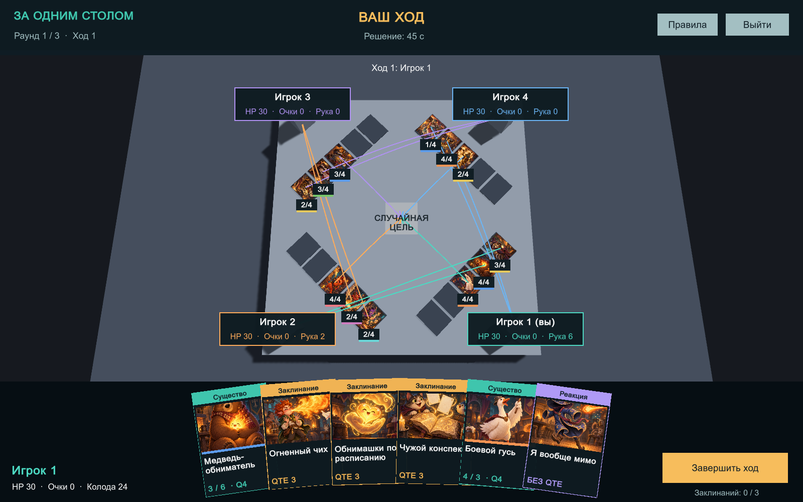

# За одним столом

Unity-прототип карточной потасовки на 2–4 игроков: 3D-стол, кубы вместо моделей, рука карт в интерфейсе, Steam-лобби и быстрый поиск. Три раунда FFA, три колоды по 30 карт, 30 уникальных карт, QTE и реакции. Дополнительно — локальная игра с передачей управления.

## Скачать и запустить

Текущая итерация: **0.2.0**. Локальный архив после сборки: `output/ZaOdnimStolom-Windows-v0.2.0.zip`.
Распакуйте **всю папку**, запустите Steam, затем `ZaOdnimStolom.exe`.
Предыдущая 2D-версия сохранена в [релизе v0.1.0](https://github.com/ErmakRu/za-odnim-stolom/releases/tag/v0.1.0).
Для сетевого теста нужны разные Steam-аккаунты. Используется тестовый App ID **480**.

В репозитории сохранены исходники, `.meta` Unity, все 33 изображения, каталог карт, PDF и результаты проверок. Архивы билдов, кэш Unity и локальные логи исключены из истории Git.

- Unity-проект: `SummonersTable`, редактор **6000.3.21f1**, Windows Build Support.
- Билд: `Builds/Windows-v0.2.0/ZaOdnimStolom.exe`; передавать всю папку или архив из `output`.
- Инструкция игроку: `docs/PLAYTEST-RU.txt`.
- PDF: `output/pdf/arena-test-decks-v0.2.pdf`.
- Редактируемый каталог: `tools/create_catalog.py`, экспорт — `Assets/Resources/Data/catalog.json`.
- Промпты изображений: `docs/art-prompts.json`; PNG — `Assets/Resources/Art`.

Иллюстрации сгенерированы встроенным OpenAI image_gen. Лицензии сторонних компонентов — в [THIRD-PARTY.txt](docs/THIRD-PARTY.txt).

Это предварительная тестовая версия. Проверены правила и 24 автоматических матча; сетевой бой между разными ПК и полный ручной прогон ещё не подтверждены. Подробности — в [отчёте проверки](docs/QA-REPORT.md).

## Сборка и проверка

Откройте проект в Unity Hub. Дождитесь импорта Steamworks.NET (закреплена версия 2025.164.1).
Меню редактора `Summoners Table > Validate rules` запускает проверки правил.
`Summoners Table > Build Windows` проверяет правила и создаёт Windows x64 билд.
Unity должен иметь активную лицензию. Сборка использует Mono и не требует Visual Studio C++.

Из командной строки можно передать Unity `-batchmode -nographics -quit -projectPath <полный путь> -executeMethod SummonersTable.Editor.BuildTools.BuildWindows -logFile <полный путь к логу>`.

## Изменения 0.2.0

- Сначала карта и цель стрелкой; центр стола означает случайную допустимую цель. Существа случайно бьют только героев.
- Публичный показ карты на 3 секунды, затем QTE только у владельца. Реакции доступны во время обеих фаз.
- Защитные эффекты реакций сохранены. После QTE и при атаках стоящих существ отдельного окна реакций нет.
- В колоде 15 существ, 12 заклинаний и 3 реакции вместо прежних 6. Уникальные карты и их ID сохранены.
- Намерения существ показаны стрелками и сохраняются между ходами. Камера меняет положение на своём/чужом ходу.
- Сетевой протокол 2 и отдельный фильтр лобби 0.2.0. Все участники должны обновить билд.

## Архитектура

`Core/GameEngine.cs` — независимые от Unity правила и проверка команд. Авторитетный хост хранит полные колоды и руки. `MatchState.View` выдаёт каждому участнику только собственную руку и скрывает QTE от всех, кроме владельца.

`SteamSession.cs` — фильтр лобби, готовность, выбор колод, SteamNetworkingMessages, аутентификация отправителя по Steam ID и членству в лобби, тайм-ауты связи. Хост не доверяет переданному номеру игрока. Пользователь не отправляет исход QTE: только нажатия клавиш.

`GameApp.cs` и `GameTableUI.cs` — меню, рука веером, стрелка выбора, приватное QTE и локальная передача управления. `TableBoard.cs` — 3D-стол, пять слотов на игрока, постоянные стрелки существ и переходы камеры. Замена серых кубов префабами описана в [3D-HANDOFF.md](docs/3D-HANDOFF.md). Все правила и описания карт загружаются из одного JSON.

`Assets/Editor/CoreTests.cs` — сценарии правил и полные детерминированные матчи. Это тестовый исполнитель команд, не игровой бот.

## Изменение баланса

1. Измените значения и текст в `tools/create_catalog.py`.
2. Запустите Python `tools/create_catalog.py`, затем `tools/build_handbook.py` (reportlab, pypdf, Pillow; Windows Arial).
3. В Unity запустите Validate rules и Build Windows.
4. При несовместимых изменениях повышайте версию каталога и билда, чтобы разделить Steam-лобби.

Документ `docs/arena-analysis-and-unity-plan.md` описывает исходную браузерную игру и ранний план. Актуальные правила — в PDF и каталоге; поздние решения пользователя имеют приоритет.

Steam App ID 480 разрешён пользователем для теста. Для релиза необходим свой App ID. Отдельные аккаунты и компьютеры нужны для полноценной проверки Steam P2P. Уход хоста завершает матч; миграции хоста, повторного входа и бота пока нет.
