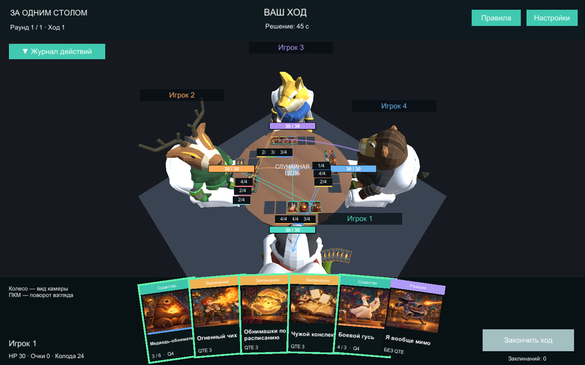

# Пропорции стола и персонажей · 0.5.2

Визуальный референс — человек ростом 1,8 м, сидящий за круглым столом диаметром 1,5 м. Существующие животные имеют мультяшные головы и короткие ноги: их анатомия сохранена, а масштаб привязан к высоте сидящей фигуры. Уши и рога выступают выше человеческого референса.

| Размер | Метры | Единицы сцены |
|---|---:|---:|
| Диаметр столешницы | 1,50 | 12,00 |
| Верх столешницы | 0,75 | 6,00 |
| Верх сиденья | 0,46 | 3,68 |
| Центр таза сидящего героя | 0,55 | 4,40 |
| Макушка сидящего референса без рогов | 1,35 | 10,80 |
| Верх спинки кресла | 1,12 | 8,96 |
| Ширина / глубина кресла | 0,70 / 0,72 | 5,60 / 5,76 |

Игра сохраняет прежний коэффициент **8 единиц сцены = 1 метр**, чтобы не менять размеры карт, слотов, стрелок и эффектов. Диаметр стола остался 12 единиц; относительно него герои увеличены с 2,25 примерно до 6,403 по Transform Scale. Общий масштаб измерен от таза до макушки барсука и применяется ко всем восьми героям. Короткие ноги позируются под сидячую посадку с опорой стоп у пола.

Стол стал выше, кресла получили согласованные размеры сиденья и спинки. Для этого создан отдельный Mesh-ассет: исходные FBX из `stuff` не изменены. Все раскладки на 2, 3 и 4 игроков используют эти пропорции. Слоты подняты на столешницу, области выбора героев увеличены, рубашки руки сдвинуты в сторону от тела. Три камеры, положение ников и шкал HP подстроены под новые размеры. Если ник пересекается со статистикой существ, шкалой HP или кнопкой журнала, он немного сдвигается в сторону. Лобби сохраняет прежнее портретное кадрирование.

## Редактирование

- `Assets/Prefabs/TableWorld.prefab` → `TableProportions` — физические ориентиры в метрах и коэффициент единиц. Изменение этих полей само по себе не перестраивает геометрию.
- Дочерние `Hero avatar` → Transform и `HeroActor` — масштаб, высота таза, длина бедра и высота стоп в единицах сцены. Положения сохранены отдельно для раскладок 2/3/4.
- `Assets/Presentation/Meshes/Armchair proportions 0.asset` — производная геометрия кресла. Можно заменить её на другую модель с нужными размерами.
- `Assets/Resources/PresentationSettings.asset` → Camera Modes — расстояние, высота, точка взгляда и угол обзора трёх камер.
- `Assets/Prefabs/Editable/UI/PlayerStatus.prefab` — отступы ников, положение и размер HP.

Команда **Summoners Table > Apply human and table proportions (0.5.2)** повторно применяет параметры `TableProportions`. Она также перезаписывает расположение кресел, масштаб героев, высоту слотов, три камеры и отступы PlayerStatus. Используйте её для повторной калибровки, а обычные художественные правки выполняйте в Prefab Mode. **Build Windows** проверяет согласованность размеров и сохраняет существующие префабы.

